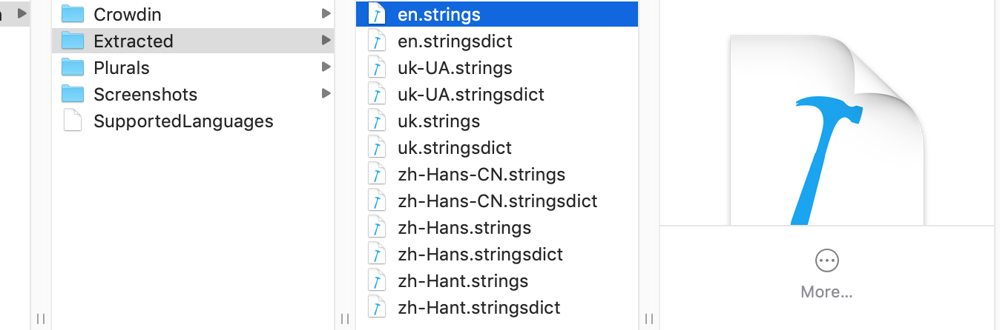
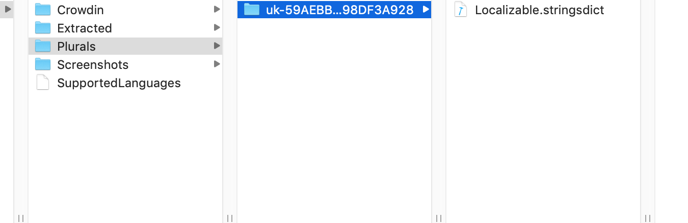

# Documents folder structre:

After application will start SDK, it will detect current device localization and download strings and plurals from the server for this localization. In your applications, Documents folder SDK will create the folder with the following pattern: "bundle id" + "Crowdin". It will keep all the needed files and folders associated with the SDK in this folder. 

## Crowdin folder
In this folder, SDK will keep all files for downloaded localizations in .plist format. Localization will be saved in files named after the localization code e.g.: en.plist, de.plist. localizations.plist file - all supported localizations from Crowdin server. SupportedLanguages.json - saved response from SupportedLanguages endpoint from Crowdin API.

## Extracted folder

Contains all extracted localizations from the application. Currently, it is used for easier upload localization to Crowdin server.

## Plurals folder 

Used for plurals localization. 

#Screenshots folder

Here sdk will save all the screenshots.
