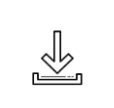

## Requirements

- Xcode 10.2 
- Swift 4.2 
- iOS 9.0

## Installation


#### Cocoapods

To install CrowdinSDK via [cocoapods](https://cocoapods.org), please make sure you have cocoapods installed locally. If not, please install it with the following command: ```sudo gem install cocoapods```. Detailed instruction can be found [here](https://guides.cocoapods.org/using/getting-started.html).

 To install it, simply add the following line to your Podfile (**!!!Will be available after publishing repo to cocoapods podspecs repo!!!**):

```ruby
pod 'CrowdinSDK'
```

To install from cocoapods spec repository (**!!!Will be available after publishing repo to cocoapods podspecs repo!!!**):

```
target 'App' do
  use_frameworks!
  pod 'CrowdinSDK'
end
```

To install from gitlab repository (**This option will be removed from this document in the future. This option is needed only for testing.**):

```
target 'App' do
  use_frameworks!
  pod 'CrowdinSDK', :git => 'git@gitlab.com:crowdin-ext/mobile-sdk-ios.git', :branch => 'develop'
end
```


To install from local sources (**This option will be removed from this document in the future. This option is needed only for testing.**):

```
target 'App' do
  use_frameworks!
  pod 'CrowdinSDK', :path => '../../CrowdinSDK' - where '../../CrowdinSDK' is path to local sources.
end
```

To enable all available features of SDK you can add following lines to your pod file: 

```
target 'App' do
  use_frameworks!
  pod 'CrowdinSDK', :git =>'git@gitlab.com:crowdin-ext/mobile-sdk-ios.git', :branch => 'develop'
  pod 'CrowdinSDK/Screenshots', :git =>'git@gitlab.com:crowdin-ext/mobile-sdk-ios.git', :branch => 'develop'
  pod 'CrowdinSDK/IntervalUpdate', :git =>'git@gitlab.com:crowdin-ext/mobile-sdk-ios.git', :branch => 'develop'
  pod 'CrowdinSDK/RealtimeUpdate', :git =>'git@gitlab.com:crowdin-ext/mobile-sdk-ios.git', :branch => 'develop'
  pod 'CrowdinSDK/RefreshLocalization', :git =>'git@gitlab.com:crowdin-ext/mobile-sdk-ios.git', :branch => 'develop'
  pod 'CrowdinSDK/Login', :git =>'git@gitlab.com:crowdin-ext/mobile-sdk-ios.git', :branch => 'develop'
  pod 'CrowdinSDK/Settings', :git =>'git@gitlab.com:crowdin-ext/mobile-sdk-ios.git', :branch => 'develop'
end
```
Please read more detailed about every feature in [Subspecs section](#subspecs).


After you've added CrowdinSDK and all needed features to your Podfile, please run ```pod install``` in your project directory, open App.xcworkspace and build it. 

## Subspecs

CrowdinSDK divided to separate parts called subspecs. To install some of these parts via cocoapods you'll need to add ```pod 'CrowdinSDK/Subspec_Name'``` in your pod file.

CrowdinSDK contains several submodules:

### Core 

This submodule contains core SDK functionality, such as functionality for switching localized strings, algorithms for current language detection.

This is default submodule, that means if you setup SDK via cocapods with pod 'CrowdinSDK' this submodule will be included.


#### Dependencies:
 - [Starscream](https://github.com/daltoniam/Starscream) - third party WebSocket client library.

### CrowdinProvider

Submodule for downloading localizations from crowdin server.

This is default submodule, that means if you setup SDK via cocapods with ```pod 'CrowdinSDK'``` this submodule will be included by default.


To setup this feature you need to setup ```CrowdinProviderConfig``` object with the following parameters:
 - hashString - Crowdin content delivery hash.
 - stringsFileNames - array of all file names for files with .strings extension (files with strings). This names can contain custom file paths.
 - pluralsFileNames - array of all file names for files with .stringsdict extension (files with plurals). This names can contains custom file paths.
 - localizations - list of all available localizations on crowdin server.
 - sourceLanguage - project source language on crowdin server.

Example: 
```
let crowdinProviderConfig = CrowdinProviderConfig(hashString: "1c2f58c7c711435295d2408106i", stringsFileNames: ["/%osx_locale%/Localizable.strings"], pluralsFileNames: ["Localizable.stringsdict"], localizations: ["en", "de"], sourceLanguage: "en")
```
Than you need to setup CrowdinSDKConfig with just created screenshots config object:

```let config = CrowdinSDKConfig.config().with(crowdinProviderConfig: crowdinProviderConfig)```

And start SDK with this config:

```CrowdinSDK.startWithConfig(config)```


#### Dependencies:
- [CrowdinSDK/Core](#core)
- [CrowdinSDK/CrowdinAPI](#crowdinapi)

### CrowdinAPI

Crowdin API implementation to work with crowdin server. To enable this feature please add pod 'CrowdinSDK/CrowdinAPI' to your pod file.

### MappingManager

All classes related to strings mapping downloading and parsing. This subspec is used only as a dependency for realtime updates and screenshots subspecs.


### Screenshots

Contains all functionality related to screenshots feature. To enable this feature please add pod 'CrowdinSDK/Screenshots' to your pod file.

To setup this feature you need to setup CrowdinScreenshotsConfig object  with the following parameters:

- login - user's login on crowdin server.
- accountKey - user's account API key.
- credentials - credentials constant which is basically base64 encoded string from test user login /password for basic authorization to for screenshots API.

Example: 
```
let credentials = "YXBpLXRlc3RlcjpWbXBGcVR5WFBxM2ViQXlOa3NVeEh3aEM="
let crowdinScreenshotsConfig = CrowdinScreenshotsConfig(login: "serhii.londar", accountKey: "1267e86b748b600eb851f1c45f8c44ce", credentials: credentials)
```
Than you need to setup CrowdinSDKConfig with just created screenshots config object:

```let config = CrowdinSDKConfig.config().with(crowdinScreenshotsConfig: crowdinScreenshotsConfig)```

And start SDK with this config:

```CrowdinSDK.startWithConfig(config)```

To create screenshot for currently displaing screen you need to call CrowdinSDK function ``` func captureScreenshot(name: String, success: @escaping (() -> Void), errorHandler: @escaping ((Error?) -> Void))```

Example:

```
CrowdinSDK.captureScreenshot(name: "My awesome screenshot", success: {
            
}) { (error) in
            
}
```


#### Dependencies:
- [CrowdinSDK/Core](#core)
- [CrowdinSDK/CrowdinAPI](#CrowdinAPI)
- [CrowdinSDK/Login](#Login)
- [CrowdinSDK/MappingManager](#MappingManager)


### RealtimeUpdate

Contains all functionality related to real-time updates feature. To enable this feature please add pod 'CrowdinSDK/RealtimeUpdate' to your pod file.


To setup this feature you need to setup CrowdinSDKConfig object. Example: 

```let config = CrowdinSDKConfig.config().with(reatimeUpdatesEnabled: true)```

And start SDK with this config:

```CrowdinSDK.startWithConfig(config)```

To start realtime updates you can call CrowdinSDK function ```func startRealtimeUpdates(success: (() -> Void)?, error: ((Error) -> Void)?)```

Example:

```
CrowdinSDK.startRealtimeUpdates(success: {
            
}) { (error) in
            
}
```

To stop realtime updates you need to call CrowdinSDK function ```func stopRealtimeUpdates()```

Example:

```CrowdinSDK.stopRealtimeUpdates()```

#### Dependencies:
- [CrowdinSDK/Core](#core)
- [CrowdinSDK/CrowdinAPI](#CrowdinAPI)
- [CrowdinSDK/Login](#Login)
- [CrowdinSDK/MappingManager](#MappingManager)

### RefreshLocalization

Contains functionality to force refresh localization strings. To enable this feature please add pod 'CrowdinSDK/RefreshLocalization' to your pod file.

#### Dependencies:
- [CrowdinSDK/Core](#core)
- [CrowdinSDK/CrowdinAPI](#CrowdinAPI)

### Login

Contains login functionality. To enable this feature please add pod 'CrowdinSDK/Login' to your pod file.

To set up this feature you need to setup create CrowdinLoginConfig object and pass it to CrowdinSDKConfig. 

For configuration you should have client id, client secret, scopes, and redirect URL scheme. 

``` swift
let loginConfig = CrowdinLoginConfig(clientId: "test-sdk",
                                 clientSecret: "79MG6E8DZfEeomalfnoKx7dA0CVuwtPC3jQTB3ts",
                                      	scope: "project.content.screenshots",
                                  redirectURI: "crowdintest://")
                                             
let crowdinSDKConfig = CrowdinSDKConfig.config().
												...
												.with(loginConfig: loginConfig)
```

Note: You should configure Authorization feature to use Almost any API calls, screenshots or realtime updates.

### IntervalUpdate

Contains functionality for update localization strings every defined time interval. To enable this feature please add pod 'CrowdinSDK/IntervalUpdate' to your pod file.

To set up this feature you need to setup CrowdinSDKConfig object. Example: 

with(reatimeUpdatesEnabled: true)

```let config = CrowdinSDKConfig.config().with(intervalUpdatesEnabled: true, interval: 5 * 60))```

And start SDK with this config:

```CrowdinSDK.startWithConfig(config)```

#### Dependencies:
- [CrowdinSDK/CrowdinAPI](#CrowdinAPI)

### Settings

Submodule for testing all features. It contains a simple view with the possibility to enable/disable following features: Force localization refresh, Interval localization updates, Real-time updates, screenshots. To enable this feature please add pod 'CrowdinSDK/Settings' to your pod file.

To display settings view you can call ```CrowdinSDK.showSettings()``` method for swift and ```[CrowdinSDK showSettings]``` for Objective-C. Note that you need to set up all features with CrowdinSDKConfig object.

Settings view have two states:

|   |  |
|:--:| :--: |
| Closed state | Open State |

Buttons and it's states explenation:

| Image | Explanation  |
|:--:| :--: |
|  | Start force localization update |
|  | Interval updates disabled |
|  | Interval updates enabled |
|  | Realtime updated disabled |
|  | Realtime updated enabled |
|  | Open State |

#### Dependencies:
- [CrowdinSDK/Screenshots](#Screenshots)
- [CrowdinSDK/RealtimeUpdate](#RealtimeUpdate)
- [CrowdinSDK/RefreshLocalization](#RefreshLocalization)
- [CrowdinSDK/IntervalUpdate](#IntervalUpdate)


## Setup

There are two ways to setup CrowdinSDK: 


### AppDelegate:

#### Swift:

In AppDelegate.swift file add:

```swift
import CrowdinSDK
```

In ```func application(_ application: UIApplication, didFinishLaunchingWithOptions 
launchOptions: [UIApplication.LaunchOptionsKey: Any]?) -> Bool``` method add your setup code: 

```swift
*1*        let crowdinProviderConfig = CrowdinProviderConfig(hashString: "1c2f58c7c711435295d2408106i", stringsFileNames: ["/%osx_locale%/Localizable.strings"], pluralsFileNames: ["Localizable.stringsdict"], localizations: ["en", "de"], sourceLanguage: "en")
*2*        let credentials = "YXBpLXRlc3RlcjpWbXBGcVR5WFBxM2ViQXlOa3NVeEh3aEM="
*3*        let crowdinScreenshotsConfig = CrowdinScreenshotsConfig(login: "serhii.londar", accountKey: "1267e86b748b600eb851f1c45f8c44ce", credentials: credentials)
*4*    CrowdinSDK.startWithConfig(CrowdinSDKConfig.config().with(crowdinProviderConfig: crowdinProviderConfig).with(intervalUpdatesEnabled: true, interval: 60).with(reatimeUpdatesEnabled: true).with(crowdinScreenshotsConfig: crowdinScreenshotsConfig).with(settingsEnabled: true))
```

1. Initialize CrowdinProviderConfig with following parameters:
 - hashString - Crowdin content delivery hash.
 - stringsFileNames - array of all file names for files with .strings extension (files with strings). This names can contain custom file paths.
 - pluralsFileNames - array of all file names for files with .stringsdict extension (files with plurals). This names can contain custom file paths.
 - localizations - list of all available localizations on crowdin server.
 - sourceLanguage - project source language on crowdin server.
2. (Optional) Create credentials constant which are basically base64 encoded string from test user login /password for basic authorization to for screenshots API.
3. (Optional) Initialize CrowdinScreenshotsConfig with following parameters:
 -     login - user's login on crowdin server.
 -  accountKey - user's account API key.
 -  credentials - value from step 2.
4. Start SDK by passing CrowdinSDKConfig. In the current example listed all options available:
 - crowdinProviderConfig - Instance of CrowdinProviderConfig from step 1.
 - intervalUpdatesEnabled - Enable interval update feature with periodic localization update from crowdin server.
 - reatimeUpdatesEnabled - Enable realtime updates feature.
 - crowdinScreenshotsConfig - Enable screenshots feature. Pass parameter from step 3.
 - settingsEnabled - Enable floating settings view with a list of all active features and its statuses.

#### Objective-C:
In AppDelegate.m file add:

```@import CrowdinSDK``` or ```#import<CrowdinSDK/CrowdinSDK.h>```.


In ```- (BOOL)application:(UIApplication *)application didFinishLaunchingWithOptions:(NSDictionary *)launchOptions``` method add: 

```objective-c
    CrowdinProviderConfig *crowdinProviderConfig = [[CrowdinProviderConfig alloc] initWithHashString:@"53376706833043f14491518106i" stringsFileNames:@[@"Localizable.strings"] pluralsFileNames:@[@"Localizable.stringsdict"] localizations:@[@"en", @"de"] sourceLanguage:@"en"];
    NSString *credentials = @"YXBpLXRlc3RlcjpWbXBGcVR5WFBxM2ViQXlOa3NVeEh3aEM=";
    CrowdinScreenshotsConfig *screenshotsConfig = [[CrowdinScreenshotsConfig alloc] initWithLogin:@"serhii.londar" accountKey:@"1267e86b748b600eb851f1c45f8c44ce" credentials:credentials];
    CrowdinSDKConfig *config = [[[CrowdinSDKConfig config] withCrowdinProviderConfig:crowdinProviderConfig] withCrowdinScreenshotsConfig: screenshotsConfig];
    [CrowdinSDK startWithConfig:config];
```

After application will start it SDK will detect current device localization and download strings and plurals from the crowdin server for this localization. 


### Info.plist 

NOTE: Currently not recommended for usage.

To setup CrowdinProvider you should add following keys to Info.plist file:

- **CrowdinHash** - hash value of Content Delivery release.
- **CrowdinProjectIdentifier** - crowdin project identifier.
- **CrowdinPluralsFileNames** - array of plurals file names on crowdin server.
- **CrowdinStringsFileNames** - array of strings file names on crowdin server.
- **CrowdinProjectKey** - project API key.
- **CrowdinLocalizations** - list of all supported localizations.

Example:


In this case, after you set up your SDK with CrowdinSDK start method, SDK will read all these values from Info.plist file and download all needed localization files from the provided Crowdin project.