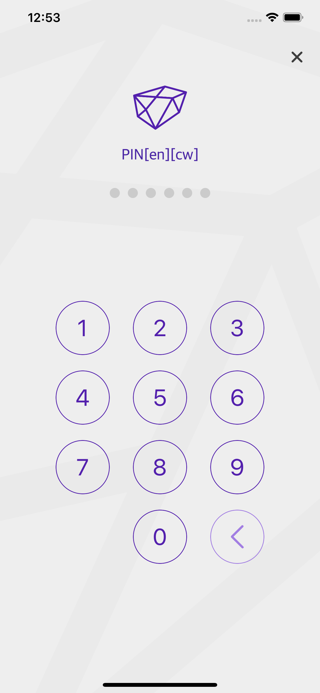
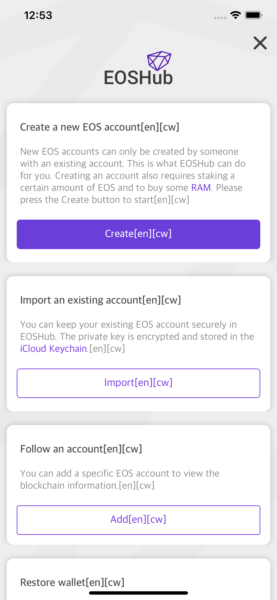
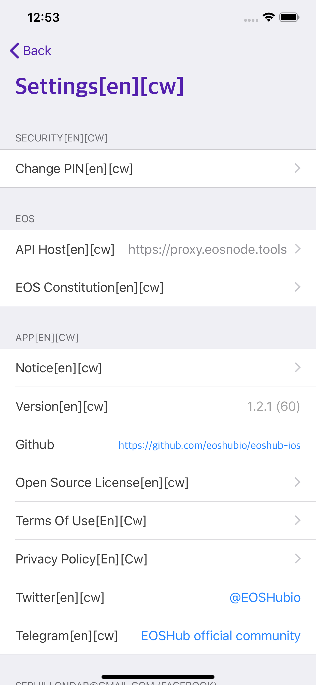

## Requirements: 

- Xcode 10.2
- Swift 4.2
- iOS 9.0

This tutorial used in this open source project: [eoshub-ios](https://github.com/eoshubio/eoshub-ios) - Easy access to the EOS network. [https://eos-hub.io](https://eos-hub.io).

#### 1. Install all dependencies via 'pod install' command:


#### 2. Check out CrowdinSDK.framework from repository home path:


#### 3. Drag end drop CrowdinSDK.framework to your xcode project:


#### 4. Add CrowdinSDK.framework to Embeded Binaries:

Press Project -> Target -> General, and under Embeded Binaries section press "Add Items" (Plus button):


Select CrowdinSDK.framework from list:


Make sure that crowdin sdk is added to "Embeded Binaries" and to "Linked Frameworks and Libraries" sections only once:


#### 5. Setup SDK.

##### Swift

In AppDelegate.swift add ```import CrowdinSDK```.

In ```func application(_ application: UIApplication, didFinishLaunchingWithOptions launchOptions: [UIApplication.LaunchOptionsKey: Any]?) -> Bool``` method add: 

```CrowdinSDK.start()```


##### Objective-C
In AppDelegate.m add ```@import CrowdinSDK``` or ```#import<CrowdinSDK/CrowdinSDK.h>```.

In ```- (BOOL)application:(UIApplication *)application didFinishLaunchingWithOptions:(NSDictionary *)launchOptions``` method add: 

```[CrowdinSDK start];```

#### 6. Run application.
When you will run your application, all localized strings should be appended with following construction:  
```[current localization][cw]```, f.e. [en][cw].






