# Test Application

To run the example project, clone the repo, and run `pod install` from the Example directory and open `CrowdinSDK.xcworkspace`.

Application downloads localization files from [https://crowdin.com/project/content-er4](https://crowdin.com/project/content-er4) crowdin project.

## Configuration

Application configured in two ways: with info plist and in AppDelegate.

AppDelegate:
```
// Setup CrowdinSDK with crowdin localization provider.
CrowdinSDK.start(with: "66f02b964afeb77aea8d191e68748abc", stringsFileNames: ["Localizable.strings", "Base.strings"], pluralsFileNames: ["Localizable.stringsdict", "Base.stringsdict"], projectIdentifier: "content-er4", projectKey: "af3d3deb8d45b7f7ac4e58c83ca2bc0c")
```     
        
Info.plist:

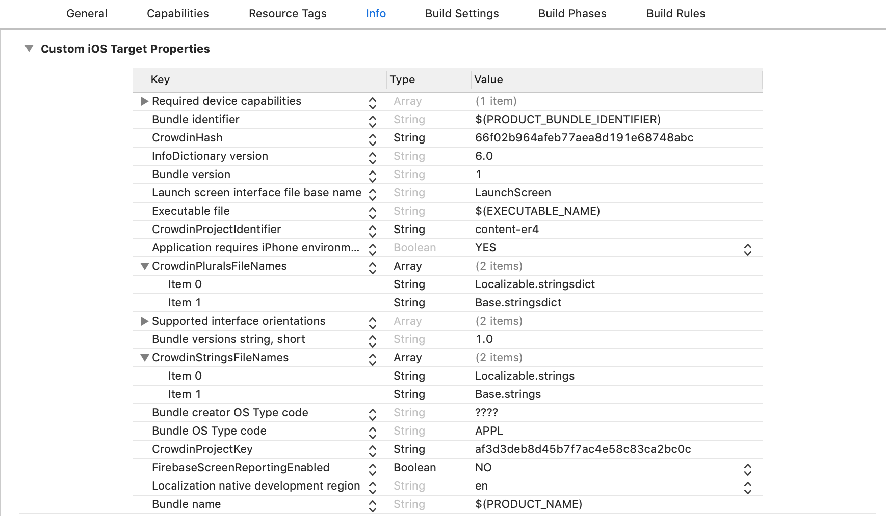

## Screens

### Main

Simple screen which have 3 labels with localized strings:

1. Simple localized string for key - "test_key", local value - "Test [BUNDLE]", crowdin value - "Test [CW]".
2. Formated localized string for key - test_with_format_key, local value - "Test parameter - %@ [BUNDLE]", crowdin value - "Test parameter - %@ [CW]". Here %@ is replaced with "Parameter" string.
3. Plurals localized string for key - "johns pineapples count", local value - "John has %u pineapples", crowdin value - "John has %u pineapples".


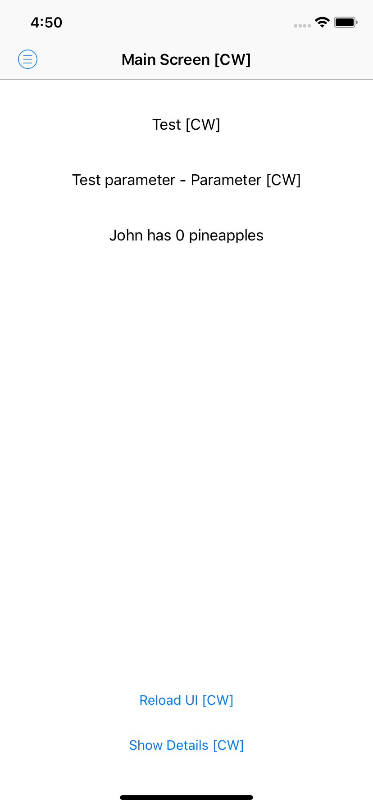

### Details

On this screen adde more standart iOS controls with test localized strings:

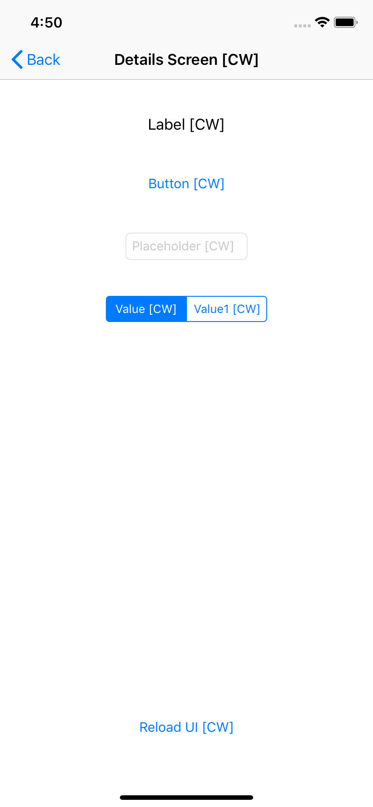


### Menu

Simple menu(not standart iOS component) for simple navigation across all application screens. Here listed all application screens:

- [Main](#main)
- [Explorer](#explorer)
- [Plurals](#main)
- [Strings](#main)
- [Settings](#main)

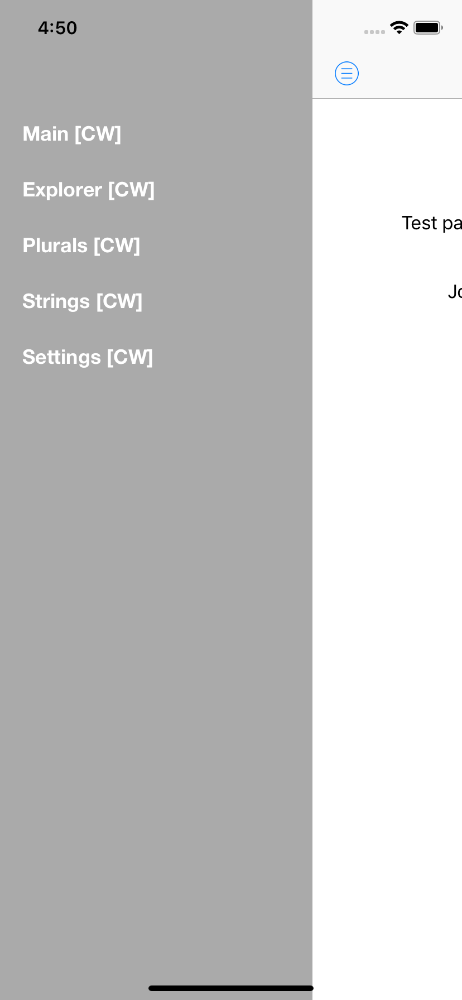

### Explorer

Screen which display all files stored in applications Documents folder with posibility to view it.

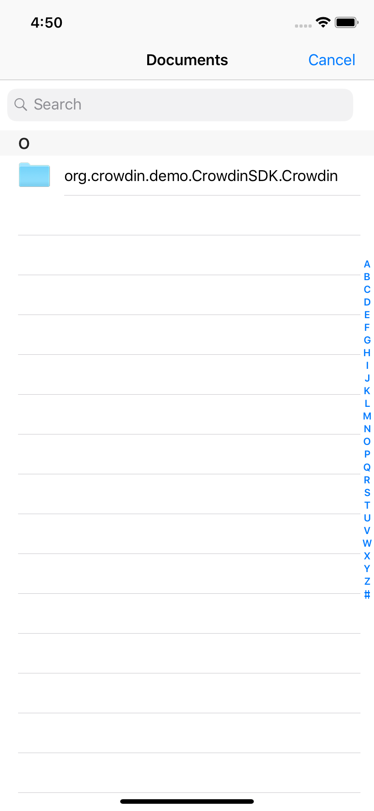

### Plurals

Screen which display all plurals downloaded from crowdin server for current locale.

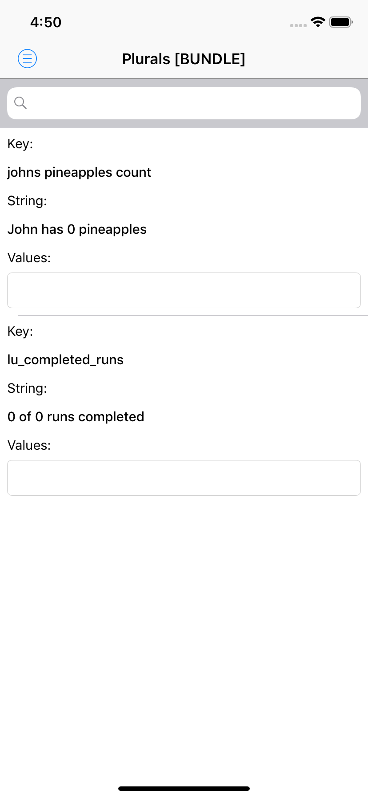

There are possibility to search localized strings by key. Also you set values to localized string from input field at the bottom:

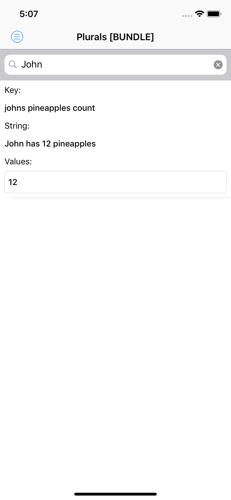

### Strings

Screen which display all strings downloaded from crowdin server for current locale.

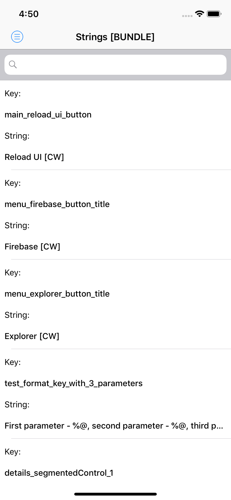

There are possibility to search localized strings by key:

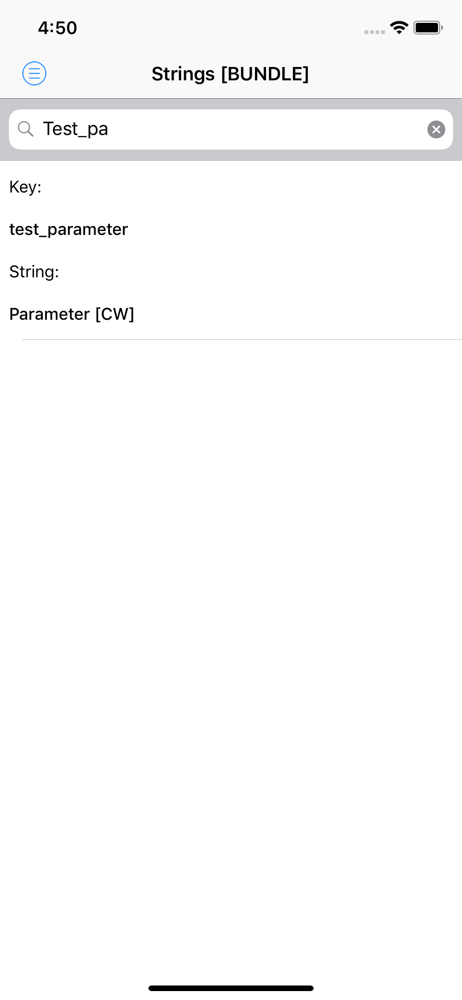

### Settings

On this screen you can see all avalaible localization in the app. This screen has two sections. In firs section listed all local localizations. By clicking on items in first section you can set local localization (it requires application restart).

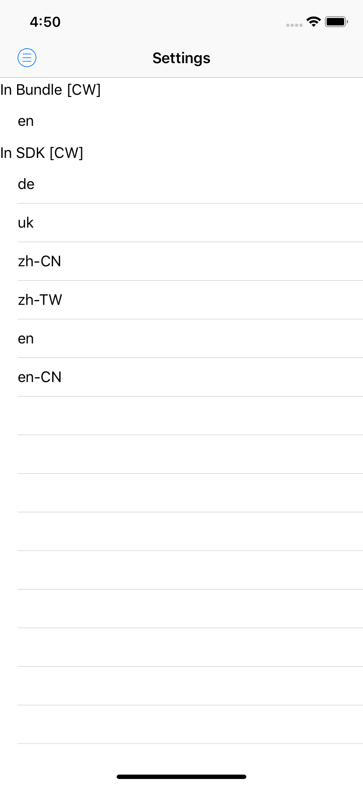

In second section listed all localizations from crowdin server, supported by current project. By clicking on items in second section you can switch between different localizations in the app.

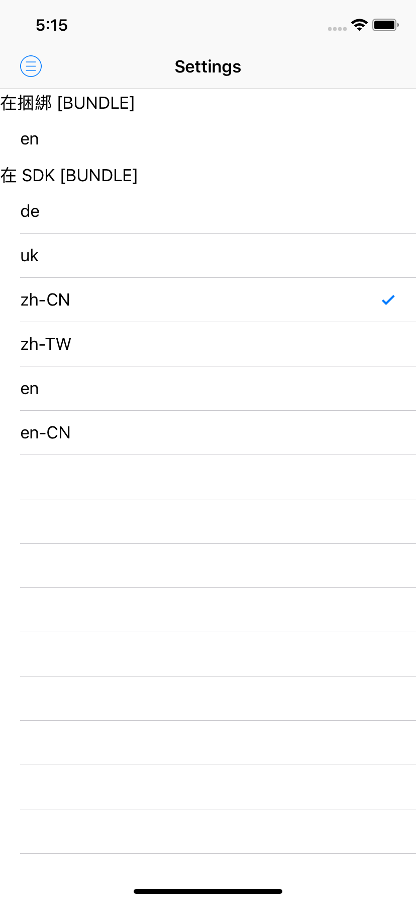